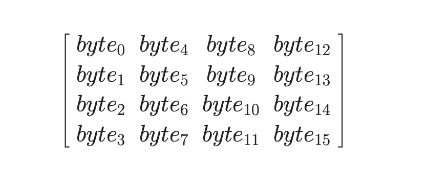

# AES (Advanced Encryption Standard)

- Symmetric key block cipher
- AES uses 10 rounds for 128-bit keys, 12 rounds for 192-bit keys and 14 rounds for 256-bit keys.
- No. of keys generated = (no. of rounds + 1)

_Input Array:_

- The input array is 16 characters long and is represented as 4x4 matrix with each character filled row wise.

_State Array:_

- Here each column is known as a word i.e [w0 w1 w2 w3]

## Encryption Process

### SubBytes:

the left four bits of a byte act as the row number and the right four bits as the column number for sbox represented in 2D matrix. However if the sbox is represented as a 1D matrix then substitution occurs directly considering the byte itself as the index of sbox.

Consider the example below:

